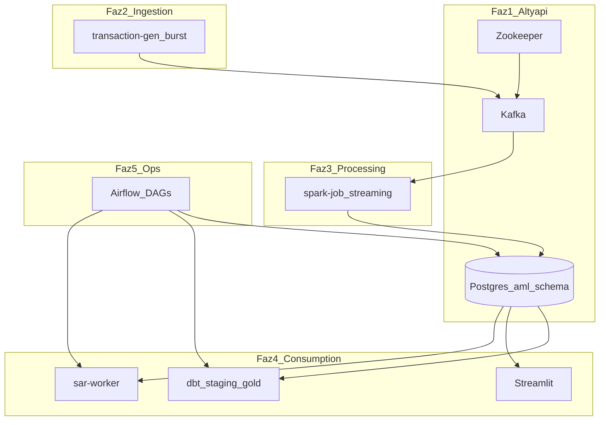

# Alpha AML Pipeline — Mimari Değerlendirme ve Operasyon Rehberi

> **Amaç:** Projenin mimarisini, teknoloji seçimlerini ve operasyonel stratejisini Lead Data Engineer perspektifinden dokümante etmek.  
> **Ortam:** Oracle Cloud Free Tier VM (6 GB RAM)  
> **Hedef kitle:** Mülakat hazırlığı, design review, gelecek geliştirme kararları

---

## 1. Proje Felsefesi ve Mimari

### 1.1 Uygulama ve deploy sırası

Doğru sıra **bağımlılık zincirini** ve **RAM bütçesini** korur.



| Sıra | Bileşen | Neden bu sırada? |
|------|---------|------------------|
| 1 | Postgres + `aml` şeması | Sink ve dashboard’un dayanağı; Spark/dbt sözleşmesi burada tanımlanır |
| 2 | Zookeeper + Kafka | Asenkron tampon; üretici ↔ işlemci decouple |
| 3 | `transaction-gen` | Burst mod ile akış testi; VM’i 7/24 yormaz |
| 4 | `spark-job` | En ağır servis (~1.5 GB); Kafka’da veri birikince devreye girer |
| 5 | dbt + Streamlit | Operasyonel tablolar dolunca anlamlı |
| 6 | `sar-worker` | Flagged veri sonrası; API maliyeti kontrollü |
| 7 | Airflow (`ops` profili) | Retention + batch transform; VM’de son açılır |

**Veri akışı:** `transaction-gen` → `transactions.raw` → Spark (30 sn micro-batch) → JDBC → Postgres → dbt / Streamlit / SAR

---

### 1.2 Bileşen bazında: Neden ve AML’e oturumu

#### Generator (`src/generator/`)

- **Neden:** Gerçek banka verisi olmadan velocity ve high-value senaryolarını tekrarlanabilir üretmek
- **AML:** Velocity = kısa sürede çok işlem (structuring/smurfing benzeri); high-value = eşik üstü transfer
- **Kısıt:** Burst (`BURST_SIZE`, `IDLE_SEC`) — simüle gerçek zamanlı yük

#### Kafka (basit kuyruk yerine)

- **Neden:** Üretici çökse bile mesaj topic’te kalır; Spark checkpoint/offset ile devam eder; çoklu consumer mümkün
- **Trade-off:** ZK (~384 MB) + Kafka (~768 MB) ≈ 1.1 GB sabit maliyet — sektör standardı vs. RAM

#### PySpark Streaming (saf Python yerine)

- **Neden:** `groupBy`, window, stateful aggregation tek motorde; checkpoint ile işleme disiplini
- **AML:** `configs/rules.yaml` ile denetlenebilir eşikler
- **Kısıt:** `local[2]`, 512m driver/executor — OOM riski en yüksek servis

#### Postgres (sink)

- **Neden:** ACID, SQL audit, compliance ekiplerinin anladığı model
- **AML:** `aml.transactions` = ingestion/audit izi (silver); `aml.flagged_transactions` = kural + karar kaydı
- **Kısıt:** 90 gün transaction retention (`cleanup_dag`, kaynak: `configs/retention.json`); window metrics 4 saat + satır cap'i ile sınırlanır

#### dbt

- **Neden:** Versiyonlanmış SQL; `sources.yml` + `schema.yml` = lineage + data contract
- **Regülasyon:** “Bu risk skoru nereden geldi?” sorusuna dokümante cevap

#### Streamlit

- **Neden:** Hızlı internal tool; monitoring + rule YAML yönetimi
- **AML:** İnsan-in-the-loop gözetim (otomasyon ≠ nihai karar)

#### GenAI SAR (`src/ai_models/`)

- **Neden:** SAR taslağı; manuel yazım süresini kısaltır
- **Kısıt:** Varsayılan mock mod; PII yerine `account_id` hash

---

### 1.3 6 GB RAM bütçesi

| Servis grubu | Yaklaşık limit (compose) | Profil |
|--------------|--------------------------|--------|
| ZK (384m) + Kafka (768m) + Postgres (1024m) | ~2.2 GB | `core` |
| Generator + SAR + Streamlit | ~0.9 GB | `app` |
| Spark | ~1.5 GB | `app` |
| Airflow (1200m) | ~1.2 GB | `ops` |

**Kural:** `core` + `app` açıkken `ops` profilini aynı anda çalıştırmamak (veya `docker stats` ile izlemek).

---

## 2. Technology Stack — Design Review

### Kafka — omurga

- Decoupled, replayable event bus (`transactions.raw`)
- Internal only: `kafka:29092` (no host port; not exposed to the internet)
- Ingestion zamanı (`ts`) ≠ işleme zamanı (`ingested_at`, `flagged_at`) → audit izi

### PySpark Streaming — fraud windowing

- Micro-batch: 30 saniye
- **Velocity:** Batch içinde `account_id` başına sayım ≥ `max_txns_per_account`
- **High-value:** `amount > threshold_eur`
- Checkpoint: `/tmp/spark-checkpoints`
- **Gap (production):** Tam sliding window + watermark henüz MVP değil

### Postgres — sink

- Şema: `aml.transactions` (silver landing), `aml.flagged_transactions`, `aml.sar_reports`, `aml.ml_customer_scores`, `aml.ml_model_runs`, `aml.event_log`
- dbt okur; Streamlit okur; Airflow temizler/tetikler
- Not: Legacy `aml.raw_transactions` tablosu emekli edildi (migration `021`); bronze katman artık Kafka `transactions.raw` topic'idir

### dbt — Data Lineage

| Katman | Karşılık | İçerik |
|--------|----------|--------|
| **Bronze (Source)** | Kafka `transactions.raw` → `aml.transactions` | Spark çıktısı (immutable landing) |
| **Silver (Staging)** | `stg_flagged_transactions` | View + testler |
| **Gold** | `gold_daily_fraud_summary`, `gold_account_risk_score`, `gold_customer_risk_profile` | Raporlama / risk tier |

### Streamlit — compliance arayüzü

11 sayfa: Overview, Monitoring, Investigation, SAR Archive, Scenarios (salt-okunur senaryo vitrini), Risk Models (ML model performansı), Analytics (trend/segment/koridor), Data Quality, System Health, Logs (merkezi event log), SQL Explorer (salt-okunur).

---

## 3. Operasyonel Strateji

### 3.1 Lifecycle management

1. **Retention:** `cleanup_dag` (@hourly) — `aml.transactions` 90 gün üzeri silinir, window metrics 4 saat + satır cap; flagged/SAR kalır  
2. **Profil disiplini:** Günlük `make up` (`core`+`app`); Airflow sadece gerektiğinde `make ops`  
3. **Burst ingestion:** Idle dönemlerde düşük CPU  
4. **İzleme:** `docker stats` — Spark/Kafka sürekli %90+ ise limit azalt  

### 3.2 AI: on-demand vs. static SAR

| Mod | Ne zaman | Maliyet |
|-----|----------|---------|
| Mock (`SAR_MOCK_MODE=true`) | Demo, mülakat, API yok | Sıfır |
| OpenAI | `OPENAI_API_KEY` + mock kapalı | Token bazlı; `SAR_BATCH_LIMIT` |
| Tetikleme | `sar-worker` (300 sn) veya `trigger_sar` DAG | Yeni flagged hesap grupları |

**Strateji:** Her işlemde değil; hesap bazında gruplanmış, daha önce SAR üretilmemiş kayıtlar.

### 3.3 Lineage özeti

```
Kafka JSON (transactions.raw = bronze)
  → Spark → aml.transactions / aml.flagged_transactions
    → dbt sources
      → staging (tests)
        → gold (aggregations)
          → Streamlit / export
```

Yeni kolon akışı: Postgres/Spark → `sources.yml` → `schema.yml` → gold model.

---

## 4. Start / Stop Runbook

Geliştirme veya demo yokken **tüm stack’i kapatın** — VM RAM’i boşalır (~1.2 GB container tasarrufu). Veriler volume’larda kalır; tekrar `make up` ile kaldığınız yerden devam edersiniz.

### 4.1 Dükkanı kapat (önerilen — yapım aşaması / mülakat öncesi)

```bash
cd /home/ubuntu/data-project
make down
```

Eşdeğeri:

```bash
docker compose --profile core --profile app --profile ops down
```

- Tüm container’lar durur ve silinir.
- **Veri kalır:** `pgdata` (Postgres), `spark-checkpoints` volume’ları silinmez.
- Airflow açık olsa bile `ops` profili dahil kapanır.

**Kontrol:**

```bash
docker ps          # liste boş olmalı (proje container’ları)
free -h            # RAM’in çoğu geri gelmiş olmalı
```

### 4.2 Dükkanı aç (tekrar çalıştırma)

```bash
cd /home/ubuntu/data-project
make up
```

İlk açılış veya kod/Dockerfile değiştiyse:

```bash
docker compose --profile core --profile app up -d --build
```

**Beklenen süre:** Kafka health ~30 sn; Spark ilk seferde paket indirebilir (**1–2 dk**).

**Sıra (otomatik):** Postgres + ZK → Kafka healthy → generator, Spark, Streamlit, SAR.

**Doğrulama:**

```bash
docker ps --format 'table {{.Names}}\t{{.Status}}'
docker compose logs -f transaction-gen   # Ctrl+C ile çık
docker exec data-project-postgres-1 psql -U user -d datadb -c \
  "SELECT COUNT(*) AS txns FROM aml.transactions; SELECT COUNT(*) AS flagged FROM aml.flagged_transactions;"
```

| Endpoint | URL |
|----------|-----|
| **Canlı (public)** | **https://utku-efe-aml.duckdns.org** — Caddy reverse proxy + otomatik Let's Encrypt HTTPS (`edge` profili) |
| Dashboard (lokal) | http://localhost:8501 |
| Airflow (sadece `make ops` sonrası) | http://localhost:8080 (admin / admin) |
| Kafka | internal only (`kafka:29092`, not exposed to host) |
| Postgres | internal only (`postgres:5432`; `docker exec ... psql`, DB: `datadb`) |

**Güvenlik duruşu (canlı deploy):** İnternete açık tek port Caddy'nin **80/443**'ü (80 → 443 yönlendirir). Streamlit yalnızca `127.0.0.1:8501`'e bağlı (reverse proxy iç ağdan `streamlit:8501`'e gider); Postgres ve Kafka host'a hiç açık değil. Dashboard salt-okunur ve auth'suz (kasıtlı public demo); yazma yolları (`freesql_reader` SELECT-only + SQL sanitizasyonu) kapalı.

### 4.3 Ne zaman ne açılır?

| Durum | Komut |
|-------|--------|
| Geliştirme yok, VM’i rahat bırak | `make down` |
| Pipeline’a devam / demo | `make up` |
| Sadece DB+Kafka test | `make core` sonra `make app` |
| Airflow DAG test (RAM izle) | `make ops` |
| Kod değişti | `make up` veya `up -d --build` |

### 4.4 Kısmi kapatma (ileride — tam kapatma yerine)

```bash
# Uygulama katmanı kapalı, altyapı ayakta (~500 MB)
docker compose --profile app stop

# Sadece dashboard kapalı
docker compose stop streamlit
```

Yapım aşamasında **kısmi değil, `make down`** yeterli.

### 4.5 Veriyi de sıfırlamak (dikkat)

```bash
make down
docker compose --profile core --profile app down -v   # volume’lar silinir — DB sıfır
```

Mülakat demosu için temiz slate istenirse kullanın; normal geliştirmede **`-v` kullanmayın**.

### 4.6 RAM referansı (açıkken)

| Mod | Yaklaşık container RAM |
|-----|-------------------------|
| Tam stack (`core` + `app`) | ~1.2–1.5 GB |
| + Airflow (`ops`) | +~0.5–1 GB |
| Kapalı (`make down`) | ~0 GB |

---

## 5. Bilinen gap’ler (MVP → Production)

| Alan | Mevcut | Hedef |
|------|--------|-------|
| Velocity kuralı | Batch içi sayım | Sliding window + watermark |
| `rules.yaml` | Spark restart | Hot-reload veya per-batch okuma |
| Secrets | `.env` | Vault / Oracle Secrets |
| Kafka alternatifi | JVM stack | README’de not: hafif broker değerlendirmesi |
| Airflow | Tek container scheduler+web | Ayrı worker veya cron fallback |
| SAR | Mock / OpenAI | On-demand + audit log |

---

## 5.1 Risk skorları (dashboard)

| Skor | Kaynak | Açıklama |
|------|--------|----------|
| **KYC Risk Score** | `aml.customers.risk_score` | Statik onboarding riski: segment + PEP + kanal + ülke (0–100) |
| **Alert Priority** | `aml.flagged_transactions.alert_priority_score` | Hybrid triage: 60% (kural tabanı + tutar/500) + 40% KYC |
| **ML Anomaly / Triage** | `aml.ml_customer_scores` | Her zaman çalışan 9. "senaryo": Isolation Forest (gözetimsiz anomali) + Gradient Boosting (gözetimli triage). `ml_score` DAG ile 6 saatte bir üretilir; **gerçek alert üretmez**, salt açıklayıcıdır. Metadata: `aml.ml_model_runs` |

KYC bantları: Düşük 0–50, Orta 50–75, Yüksek 75–100.

---

*Son güncelleme: canlı HTTPS deploy sonrası mimari ve operasyon özeti. `README.md` vizyon ve klasör yapısı için; bu dosya operasyonel ve değerlendirme bağlamı içindir; derin teknik gezinti için `efe_system.md`.*
