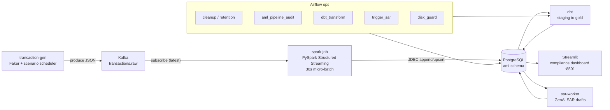

# Alpha AML — Real-Time Fraud Detection & AML Platform

> An end-to-end, production-style **streaming data platform** that flags money-laundering and fraud **the instant a payment happens** — built and operated solo, running 24/7 on a single 6 GB cloud VM.


**Live demo:** _self-hosted, HTTPS — link coming soon_ · **Domain:** banking & fraud / AML

---

## What it is

Alpha AML simulates the real-time fraud-detection backbone of a European bank. Synthetic payments are produced continuously, streamed through Kafka, scored against AML rules in Spark Structured Streaming, persisted in PostgreSQL, transformed into a Bronze/Silver/Gold warehouse with dbt, and served through a multi-page Streamlit compliance dashboard — with Airflow orchestrating retention, audits, GenAI SAR drafting and disk/memory guards.

I designed and operate **every layer myself** — ingestion, streaming analytics, the data model, orchestration, serving and ops — to demonstrate how I build reliable, cost-aware big-data systems on top of genuine AML/fraud domain knowledge.

> All data is **synthetic** (generated with `Faker` + scenario injectors). No real customer or payment data is used.

---

## Architecture



**End-to-end:** `transaction-gen` → Kafka topic `transactions.raw` → `spark-job` (30s micro-batches: normalize → enrich → window aggregates → 8 AML rules → alert budgeting → priority scoring) → Postgres `aml.*` → dbt gold models / Streamlit / `sar-worker`.

---

## Key features

- **Real-time streaming rule engine** — PySpark Structured Streaming evaluates 8 AML typologies over rolling daily/weekly/biweekly/monthly windows, one alert per customer per rule per batch.
- **Medallion data model in dbt** — Bronze (raw stream) → Silver (operational aggregates + dbt staging views) → Gold (risk/reporting tables) with `not_null` / `unique` / `accepted_values` tests and explicit `ref()` lineage.
- **Orchestration with Airflow** — config-driven retention, hourly pipeline audits, daily dbt runs, GenAI SAR triggering, and a disk/memory guard that protects the VM.
- **Compliance dashboard (Streamlit)** — 8 pages (below), dark theme, full **i18n in EN / DE / TR**.
- **GenAI SAR drafting** — groups flagged activity per account, hashes the account id (PII-safe), and drafts a Suspicious Activity Report via OpenAI (with a deterministic mock fallback when no API key is set).
- **Cost-aware engineering** — tuned per-service memory budgets, alert budgeting to prevent analyst fatigue, automatic data retention, and a self-healing ops profile, all on a single 6 GB Oracle Cloud free-tier VM.

### Detection scenarios

| Typology | Window | Trips when… |
|---|---|---|
| Geographic risk | per-txn | transfer involves a high-risk / blocked jurisdiction |
| High-value transfer | per-txn | a single transaction exceeds €10,000 |
| Structuring / smurfing | weekly | ≥ 12 transactions under €500 in a week |
| Transaction velocity | daily | > 5 transactions (each ≤ €1,000) in a day |
| Volume anomaly | weekly | weekly outbound volume exceeds €10,000 |
| Peer-group anomaly | monthly | > ~20 txns/month (8 peer baseline × 2.5) |
| Dormant reactivation | per-txn | large activity (≥ €3,000) on a dormant account |
| Money mule | 24h | ≥ 5 distinct external senders to one receiver |

Thresholds live in [`configs/rules.json`](configs/rules.json) and the scenario catalog in [`configs/scenario_catalog.json`](configs/scenario_catalog.json) — a single source of truth shared by the Spark engine and the dashboard.

### Dashboard pages

`Overview` (recruiter-facing story + live KPIs) · `Monitoring` (alerts, risk distribution, live feed) · `Investigation` (drill into an alert or a customer 360) · `SAR Archive` · `Scenarios` (read-only typology catalogue with live thresholds) · `Data Quality` · `System Health` (pipeline freshness, Airflow DAG health, source-consistency checks, throughput, storage) · `SQL Explorer` (read-only, restricted DB role).

---

## Tech stack

| Layer | Technology |
|---|---|
| Ingestion | Python, `Faker`, `confluent-kafka` |
| Streaming | Apache Kafka 7.5, PySpark 3.4 Structured Streaming |
| Storage | PostgreSQL 16 |
| Transformation | dbt 1.7 (medallion: staging → gold) |
| Orchestration | Apache Airflow 2.8 |
| Serving | Streamlit (SQLAlchemy), Altair |
| GenAI | OpenAI (optional; mock fallback) |
| Packaging / ops | Docker Compose, profiles, Makefile |

---

## Quickstart

Requires Docker + Docker Compose.

```bash
# 1. Configure environment
cp .env.example .env          # edit secrets as needed (OPENAI_API_KEY optional)

# 2. Bring up core + app (Kafka, Postgres, generator, Spark, dashboard)
make up

# 3. Open the compliance dashboard
#    http://localhost:8501

# 4. (optional) Add the orchestration layer (Airflow)
make ops                      # Airflow at http://localhost:8080  (admin / admin)
```

Other targets: `make down`, `make logs`, `make core`, `make app`, `make ops`.

> Compose **profiles** (`core`, `app`, `ops`) let the stack run within a 6 GB RAM budget — `ops` (Airflow) can be brought up only when needed.

---

## Project structure

```text
alpha-aml-platform/
├── src/
│   ├── generator/      # synthetic txn producer + 8 scenario injectors + customer onboarding
│   ├── processing/     # PySpark streaming job, window engine, alert budget & priority
│   ├── dashboard/      # Streamlit app, pages, i18n (en/de/tr), DB access
│   ├── ai_models/      # GenAI SAR generator (OpenAI + mock fallback)
│   └── common/         # shared utilities (retention config)
├── configs/            # rules.json/yaml, scenario_catalog.json, retention.json, DQ rules
├── dbt/                # dbt project: staging + gold models, sources, tests
├── orchestration/      # Airflow DAGs (cleanup, audit, dbt_transform, sar, disk_guard)
├── docker/             # init SQL + numbered schema migrations
├── scripts/            # start.sh, disk_guard.sh
├── docker-compose.yml  # 8-service stack (profiles: core / app / ops)
└── Makefile
```

---

## What this project demonstrates

**Data Engineering** — event streaming (Kafka), stateful stream processing (Spark Structured Streaming, windowed aggregates), dimensional/medallion modelling (dbt Bronze/Silver/Gold with tested lineage), workflow orchestration (Airflow), containerization (Docker Compose), and pragmatic resource/cost optimization on constrained infrastructure.

**Data Analysis** — a tested SQL warehouse, business KPIs (alert volumes, risk-band distribution, daily fraud summaries, customer 360), an interactive compliance dashboard, and a read-only SQL explorer — framed around real AML/banking metrics (SAR, KYC, PEP, typologies).

**Data Science (on the roadmap)** — engineered behavioral features already exist in the gold layer (`txn_count_30d`, `volume_30d`, `distinct_receivers_30d`, `flag_count_30d`, …) ready to feed an **unsupervised anomaly model (Isolation Forest)** and a **supervised alert-triage classifier** that will be benchmarked (precision/recall/ROC-AUC) against the rule baseline.

---

## Engineering highlights

- **Alert budgeting** — caps (~100/day, ≤ 12 per rule) and one-alert-per-customer-per-rule-per-batch to model real analyst-fatigue constraints.
- **Config-driven retention** — lifecycle rules in [`configs/retention.json`](configs/retention.json), enforced by Airflow, so the database never grows unbounded.
- **Self-healing ops** — a disk/memory guard runs every 15 minutes and emergency-trims the fastest-growing table before space runs out; services use `restart: unless-stopped`.
- **Idempotent stream writes** — window metrics use calendar-aligned `window_start` + `INSERT … ON CONFLICT DO UPDATE` upserts to keep operational tables bounded.

---

## Roadmap

- [ ] Automated test suite (pytest) + GitHub Actions CI (lint, tests, `dbt parse`)
- [ ] ML layer: Isolation Forest anomaly detection + supervised triage model, surfaced in a "Risk Models" dashboard page
- [ ] Public HTTPS live demo
- [ ] Analyst "Insights" notebook (cohort / trend / false-positive analysis)

---

## Notes

This is a personal portfolio project built to showcase data engineering, analytics and (soon) ML skills in the AML/fraud domain. All data is synthetic. Detection is currently **rule/threshold-based** (an ML layer is planned, see roadmap). See [`EVALUATION.md`](EVALUATION.md) and [`efe_system.md`](efe_system.md) for a deep architecture and operations walkthrough.
